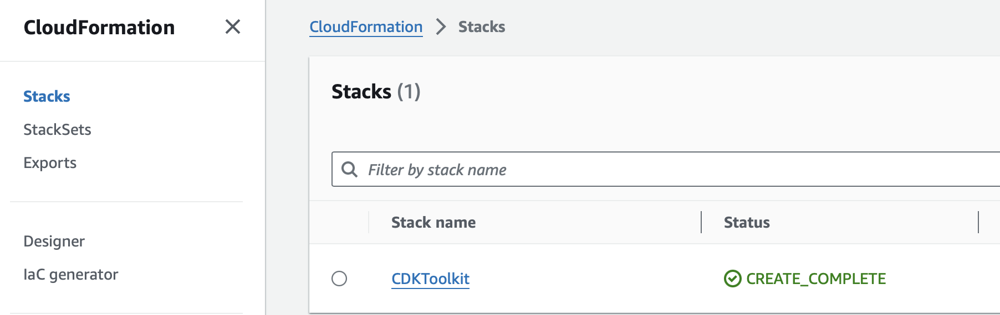

## Note
This repo contains the detail setup for reproducing our experiment result. For the source code of our system implementation, please go to https://github.com/hyoer0423/ray/tree/protbuf. Additionally, this repo contrains pre-built wheel files of our implementation. If you would like to compile it from source or build the wheel on your own, please go to the source code repo and follows Ray compile instructios [here](https://docs.ray.io/en/latest/ray-contribute/development.html). 


# Toturial for Running Experiments

In this tutorial, I will be illustrating how to reproduce the experimental results of our research. In this totorial, I will cover the steps of setting up a test platform using [AWS CDK](https://docs.aws.amazon.com/cdk/v2/guide/getting_started.html), and configure the software dependencies of our system using our setup script in our [cloud infra](https://github.com/HPC-cloud-burst-with-ray/cloud-infra) repo. Then I will go through the steps of 

The illustration of our test platform has been covered the research paper. In a nutshell, we hope to simulate the hybrid cloud environment using AWS infrastructure. We setup a HPC cluster using one AWS VPC and then setup another cloud cluster in another AWS VPC to represent the cloud node resources. The two clusters will be connected with each other via [sshuttle](https://sshuttle.readthedocs.io/en/stable/overview.html), which is an application level VPN software, which capture TCP traffic and forward the packets through the safe ssh tunnel. With this network environment setup with VPN, we will launch the [Ray](https://docs.ray.io/en/latest/) system across the two clusters together with our own scheduler daemon and then run the workloads we provided. 

We also provide the Ray wheel file containing our dynamic labelling feature, and our scheduler is based on this dynamic labelling feature to achieve a decent performance boost over the Ray default scheduler by streaming the ray task computation and data transmission. 

## Getting started

The test environment is totally inside the AWS. With our simulated framework for hybrid cloud environement, we can easily simulate the network bandwidth and latency in the real HPC cloud setup. With AWS CDK, we can define our infrastruture using our familiar programming language, like Typescript. With the infrastructure setup, we have provided the `setup.py` to help users setup ssh configuration, software dependecies, network environment and daomon processes. 

#### Configure AWS Test Platform

Please follow the [AWS official tutorial](https://docs.aws.amazon.com/cdk/v2/guide/getting_started.html#getting_started_auth) to setup `Node.js` and `AWS CLI` environment in your **local computer**. Please make sure that `aws --help` and `npm --help` can work. We recommend using `nvm` to control the `npm` versions. 

You need to make sure you can create a **AWS Access Key** and then run `aws configure --profile <profile_name>` to setup AWS  credential. Run `cat ~/.aws/config` and `cat ~/.aws/credentials` to examine your crendential. 

You can also run the command below to verify that you have successfully configured AWS crendential. 

```
aws ec2 describe-instance-types --instance-types m5.large
```

Please also make sure the `boto3` is installed locally.

```
pip install boto3
```

Then please git clone our cloud infra repo, which contains everything we need to run the experiments.

```
git clone https://github.com/HPC-cloud-burst-with-ray/cloud-infra.git
cd cloud-infra
```

Then we need to install all the required node modules.

```
npm run build
```

Please edit the `cdk-app-config.json` in the folder, you can see that we are using `XLARGE4` instances to run our experiments, and the HPC side will have one login node and one worker node. While for the cloud side, we have one node by default. In total, our default setup will have 3 nodes, but you can change the config file to allocate more. 

In the config file, you can see that we have a filed called `"environment"`. In this field, please edit the `SSH_PUB_KEY` with your local computer's ssh pub key to make sure that your local laptop have access to all the nodes allocated. You can find it by `cat ~/.ssh/id_rsa.pub` or you can create one by `ssh-keygen -t rsa`. Also change the `CDK_DEPLOY_ACCOUNT` and `CDK_DEPLOY_REGION` to your account number and your favourite region. 


You need to check if you have already bootstraped the CDK toolkit before. Please login to your AWS console, select the **Availability Zone** you want, search **Cloud Formation**, if you then see a CDKToolkit like below, skip the next command.



Otherwise, you need to bootstrap CDK first. 

```
cdk bootstrap
```

Then you just need to run the two commands below to setup one HPC cluster and one cloud cluster. AWS Elastic File Systems (EFS) are also created and mounted to the `~/share` folder to represent the NFS in typical HPC systems. 

First deploy the simulated HPC cluster (on premise nodes).

```
cdk deploy OnPremStack
```

Then deploy the cloud nodes.

```
cdk deploy CloudStack
```

Please note that some personal AWS accounts might have a quota limit about the total number of vCPUs that can be allocated. We used in total 48 vCPUs in our paper. If you encounter deployment failure about quota, you can either [submit a request to AWS](https://repost.aws/knowledge-center/ec2-on-demand-instance-vcpu-increase) for more resource because of a research (this should be very quick), or you can edit the `cdk-app-config.json` and reduce `XLARGE4` to `XLARGE2`. 

#### Setup Software Dependency

Then let's setup with our script. **We have to make sure python module `boto3` is working under your account the availbility zone you just deployed to. Run `cat ~/.aws/config` and `cat ~/.aws/credentials` to examine your crendential make sure they match with the account and region you wrote into the cdk-app-config.json file.**

With the EC2 nodes created like above, run the following command to setup every software dependency you need. 

```
python3 setup.py --install-all-deps --custom-ray-wheel https://github.com/HPC-cloud-burst-with-ray/paper-reproduce/raw/main/wheels/ray-3.0.0.dev0-cp310-cp310-linux_x86_64.whl
```

In the output you might be able to see some "ERROR" text about python package conflicts, you can just ignore them because these package conflicts was part of Ray issues about using `fastapi` in source code version 2.8.5 and we resolve this by the workaround in [Ray Issue 39722](https://github.com/ray-project/ray/issues/39722). 

(OPTIONAL) We also host the ray wheel asset through S3 (might expire because of cost) `s3://187213755865-wheelbucket/ray-3.0.0.dev0-cp310-cp310-linux_x86_64.whl `, pass it to `--custom-ray-wheel` if you want. 

#### Run Ray

Then we just need to run the ray and sshuttle. By default, if we don't limit the bandwidth, the bandwidth between HPC and Cloud nodes is limited by the sshuttle. `iperf3` shows that the bandwidth is around 220Mbits/sec. This is our default case, you can run ray by the command below. Here the `mirror` option is about setting up a bidirectional file syncing tool between HPC and cloud nodes using [Mirror](https://github.com/stephenh/mirror). It's a nice tool, but since we only transmit the files needed for computing tasks, we just skip it. 

```
python3 setup.py --skip-config-ssh --run-sshuttle --skip-mirror --run-ray
```

We have also provided different network bandwdith config files (30Mbits/sec, 50Mbits/sec, 100Mbits/sec, 150Mbits/sec, 200Mbits/sec) to test. The network emulation is done by the **tc netem**. 

```
python3 setup.py --skip-config-ssh --run-sshuttle --run-tc-netem --skip-mirror --run-ray --network-topology network_topology_200m.json
```

Change the `_200m.json` to other netowrk speed like `_150m.json` to test with different bandwidth. 

The setup command is also going to output a command like below, if you run the command and then open up `localhost:8265` in your local browser, you can see the **Ray Dashboard**.

```
ssh -L 8265:localhost:8265 ec2-user@<some IP address>
```

You can also shutdown all the active processes and network emulation by `--shutdown`.

```
python3 setup.py --skip-config-ssh --shutdown
```

## Ray Workloads for Testing

The first workload we provide is called the parameter server which is a distribued training workload. In this workload, we setup a centralized parameter server for the exchange of gradients, while each worker nodes will be producing gradients using a batch of the dataset. 

The second workload we provide is the called the image transmission, aiming to simulate the ML inference workloads, which is basically transforming the input images using pytorch. 

For each of the workload, we have two subcases (in total 4 experiments):

- The data is ready in HPC nodes, but not synced to cloud ndoes (too time-consumping to transfer all of them)
- The data is ready in AWS S3, both HPC and cloud nodes should download from S3

Let's get started!

#### Parameter Server

In this workload, since the dataset we use is quite large. We can first download the dataset to local folder `~/`, decompress there and then we randomly pick the images needed into the `~/share` folder, which is the NFS. 

Please get into the login node. You can see which node is login node by the node name in aws web console. 

```
ssh ec2-user@<login node IP address>
```

Download the dataset by the commands below.

```
(login node)$ cd ~ && git clone https://github.com/HPC-cloud-burst-with-ray/paper-reproduce.git
(login node)$ cd ~/paper-reproduce
(login node)$ ./download_dataset.sh
```

Then you should randomly pick the part of dataset needed. The images will be in the `dataset_batch`. You can edit batch size and num directories needed in `const.py`. 

```
(login node)$ cd ~/share/Ray-Workloads/ml/param-server-PASS
(login node)$ python3 into_dir.py
```

Also upload those images to your AWS S3 to run the experiments when both HPC and cloud don't have images locally and need to download from S3.

```
# create a bucket if you don't have one (optional)
aws s3 mb s3://<bucket-name>
# upload to bucket
aws s3 cp dataset_batch/ s3://<bucket-name>/dataset_batch/ --recursive
```

Then we can run the first test **without** our scheduler daemon, you will see the time consumption in output. 

```
(login node)$ python3 param-server.py
```

Please **ssh into the cloud node**, run `cd ~/share/Ray-Workloads/ml/param-server-PASS/`, check how many images are allocated to the cloud node to process by `ls dataset_batch`. Then we need to **remove those images to run the next round of expriment with our scheduler**. 

``` 
(cloud node)$ cd ~/share/Ray-Workloads/ml/param-server-PASS/
(cloud node)$ rm -rf dataset_batch
```

Then let's test with the scheduler. 

Then open up another ssh terminal into the login node to run our scheduler daemon.

```
(login node)$ cd ~/ray/python/ray/scheduler
(login node)$ python3 init.py
```

Run the workload again and see the time.

```
(login node)$ cd ~/share/Ray-Workloads/ml/param-server-PASS/
(login node)$ python3 param-server.py sched
```

#### Parameter Server with S3

*Now we have seen the performance difference when HPC has the local while cloud nodes don't have data, then we can test the case when all the data is in S3. We also have two experiments here, with and without scheduler.*

First use the S3 without open up the scheduler. Make sure the dataset transferred in cloud nodes have been deleted like below.

```
(cloud node)$ cd ~/share/Ray-Workloads/ml/param-server-PASS/
(cloud node)$ rm -rf dataset_batch
```

Then go to your local laptop, restart the Ray cluster with your desired network bandwidth profile by the setup script.

```
(your local laptop)$ python3 setup.py --skip-config-ssh --shutdown
(your local laptop)$ python3 setup.py --skip-config-ssh --run-sshuttle --run-tc-netem --skip-mirror --run-ray --network-topology network_topology_200m.json
```

Get into the login node, run the workload and see the time output.

```
(login node)$ python3 param-server-s3.py manu <bucket_name> dataset_batch
```

**Remove the dataset downloaded in `dataset_batch_s3` from S3 in both cloud nodes and HPC nodes.**

```
# cloud nodes
(cloud node)$ cd ~/share/Ray-Workloads/ml/param-server-PASS/
(cloud node)$ rm -rf dataset_batch_s3
# HPC login node
(login node)$ cd ~/share/Ray-Workloads/ml/param-server-PASS/
(login node)$ rm -rf dataset_batch_s3
```

Get into the login node, run the scheduler daemon.

```
(login node)$ cd ~/ray/python/ray/scheduler
(login node)$ python3 init.py
```

In another login node shell, run the workload using S3, you will see the downloaded images in `dataset_batch_s3`. 

```
(login node)$ cd ~/share/Ray-Workloads/ml/param-server-PASS/
(login node)$ python3 param-server-s3.py sched <bucket_name> dataset_batch
```

#### Image Transformation

Please get into the login node. You can see which node is login node by the node name in aws web console. 

```
ssh ec2-user@<login node IP address>
```

Then you should download the images needed. The images will be in the `task_images`.

```
(login node)$ cd ~/share/Ray-Workloads/basics/image_tr
(login node)$ python3 download.py
```

Also upload those images to your AWS S3 to run the experiments when both HPC and cloud don't have images locally and need to download from S3.

```
# create a bucket if you don't have one (optional)
aws s3 mb s3://<bucket-name>
# upload to bucket
aws s3 cp task_images/ s3://<bucket-name>/task_images/ --recursive
```

Then we can run the first test **without** our scheduler daemon, you will see the time consumption in output. 

```
(login node)$ python3 image.py
```

Please **ssh into the cloud node**, run `cd ~/share/Ray-Workloads/basics/image_tr/`, check how many images are allocated to the cloud node to process by`ls task_images`. Then we need to **remove those images to run the next round of expriment with our scheduler**. 

``` 
(cloud node)$ cd ~/share/Ray-Workloads/basics/image_tr/
(cloud node)$ rm -rf task_images
```

Then open up another ssh terminal into the login node to run our scheduler daemon.

```
(login node)$ cd ~/ray/python/ray/scheduler
(login node)$ python3 init.py
```

Run the workload again and see the time.

```
(login node)$ cd ~/share/Ray-Workloads/basics/image_tr
(login node)$ python3 image.py sched
```

#### Image Transformation with S3

*Now we have seen the performance difference when HPC has the local while cloud nodes don't have data, then we can test the case when all the data is in S3. We also have two experiments here, with and without scheduler.*

First use the S3 without open up the scheduler. Make sure the images transferred in cloud nodes have been deleted like below.

```
(cloud node)$ cd ~/share/Ray-Workloads/basics/image_tr/
(cloud node)$ rm -rf task_images
```

Then go to your local laptop, restart the Ray cluster with your desired network bandwidth profile by the setup script.

```
(your local laptop)$ python3 setup.py --skip-config-ssh --shutdown
(your local laptop)$ python3 setup.py --skip-config-ssh --run-sshuttle --run-tc-netem --skip-mirror --run-ray --network-topology network_topology_200m.json
```

Get into the login node, run the workload and see the time output.

```
(login node)$ python3 image_s3.py manu <bucket_name> task_images
```

**Remove the dataset downloaded in `task_images_s3` from S3 in both cloud nodes and HPC nodes.**

```
# cloud nodes
(cloud node)$ cd ~/share/Ray-Workloads/basics/image_tr/
(cloud node)$ rm -rf task_images_s3
# HPC login node
(login node)$ cd ~/share/Ray-Workloads/basics/image_tr/
(login node)$ rm -rf task_images_s3
```

Get into the login node, run the scheduler daemon.

```
(login node)$ cd ~/ray/python/ray/scheduler
(login node)$ python3 init.py
```

In another login node shell, run the workload using S3, you will see the downloaded images in `task_images_s3`. 

```
(login node)$ cd ~/share/Ray-Workloads/basics/image_tr
(login node)$ python3 image_s3.py sched <bucket_name> task_images
```


